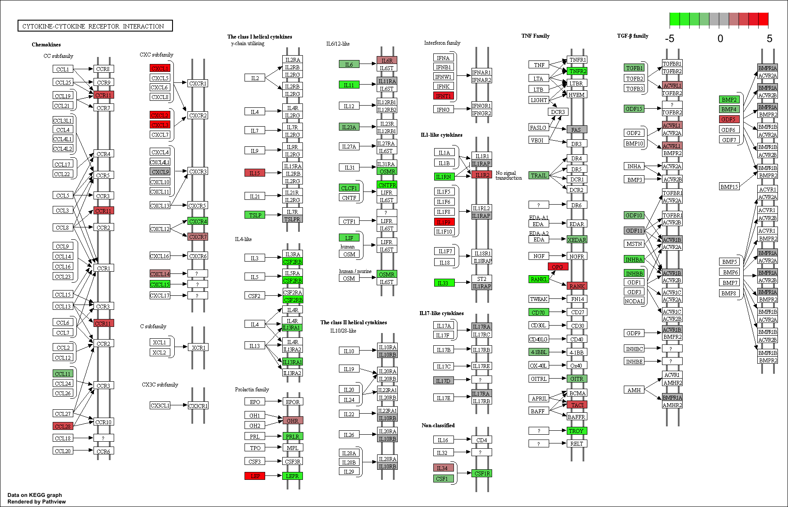

```{r setup, include=FALSE}
library(tidyverse)
library(fgsea)
library(goseq)
library(clusterProfiler)
library(pathview)
```

```{r prepareData, include=FALSE}
load("../Robjects/Annotated_Results_LvV.RData")
# fgsea data
gseaDat <- filter(shrinkLvV, !is.na(Entrez))
ranks <- gseaDat$logFC
load("../Robjects/mouse_H_v5.RData")
pathwaysH <- Mm.H
# Kegg data
sigGenes <- shrinkLvV$Entrez[ shrinkLvV$FDR < 0.01 & 
                              !is.na(shrinkLvV$FDR) &
                              abs(shrinkLvV$logFC) > 1 ]
sigGenes <- na.exclude(sigGenes)
kk <- enrichKEGG(gene = sigGenes, organism = 'mmu')
```

> ## Challenge 1 {.challenge}
>
> Another common way to rank the genes is to order by pvalue, but also, sorting
> so that upregulated genes are at start and downregulated at the other - 
> you can do this combining the sign of the fold change and the pvalue.
> 1. Rank the genes by statisical significance - you will need to create
> a new ranking value using `-log10({p value}) * sign({Fold Change})`
> 2. Load the "C2" pathways from the the `data/mouse_c2_v5.RData` file
> 3. Run `fgsea` using the new ranked genes and the C2 pathways
> 4. Run `fgsea` using the new ranked genes and the H pathways. How do these 
> results differ from the ones we got when ranking by the fold change alone?

```{r solution1}
ranks <- -log10(gseaDat$pvalue) * sign(gseaDat$logFC)
names(ranks) <- gseaDat$Entrez  

load("../Robjects/mouse_c2_v5.RData")
pathwaysC2 <- Mm.c2

fgseaResC2 <- fgsea(pathwaysC2, ranks, minSize=15, maxSize = 500, nperm=1000)
head(fgseaResC2[order(padj, -abs(NES)), ], n=10)

fgseaResH <- fgsea(pathwaysH, ranks, minSize=15, maxSize = 500, nperm=1000)
head(fgseaResH[order(padj, -abs(NES)), ], n=20)

```

> ## Challenge 2 {.challenge}
>
> 1. Create a gene list for genes that are up-regulated by at least 4x (logFC>2)
> in lactating mice
> 2. Run a `goseq` analysis on this gene list
> 3. Plot the results
> 4. How is this result different to the previous GO analysis?

Look at genes that are up regulated by at least 4x (logFC>2) in lactating mices

```{r solution2, message=FALSE}
isSigGeneUp <- shrinkLvV$FDR < 0.01 &
    !is.na(shrinkLvV$FDR) &
    shrinkLvV$logFC > 2

genesUp <- as.integer(isSigGeneUp)
names(genesUp) <- shrinkLvV$GeneID

pwf <- nullp(genesUp, "mm10", "ensGene", bias.data = shrinkLvV$medianTxLength)

goResultsUp <- goseq(pwf, "mm10","ensGene", test.cats=c("GO:BP"))

goResultsUp %>%
    top_n(10, wt=-over_represented_pvalue) %>%
    mutate(hitsPerc=numDEInCat*100/numInCat) %>% 
    ggplot(aes(x=hitsPerc, 
               y=term, 
               colour=over_represented_pvalue, 
               size=numDEInCat)) +
        geom_point() +
        expand_limits(x=0) +
        labs(x="Hits (%)", y="GO term", colour="p value", size="Count")
```

> ## Challenge 3 {.challenge}
>
> 1. Use `pathview` to export a figure for "mmu04060", but this time only
> use genes that are statistically significant at FDR < 0.01

```{r solution3}
sigGenes <- shrinkLvV$FDR < 0.01 & !is.na(shrinkLvV$FDR)

logFC <- annotLvV$logFC[sigGenes]
names(logFC) <- annotLvV$Entrez[sigGenes]

pathview(gene.data = logFC, 
         pathway.id = "mmu04060", 
         species = "mmu", 
         limit = list(gene=5, cpd=1))
```

mmu04060.pathview.png:



