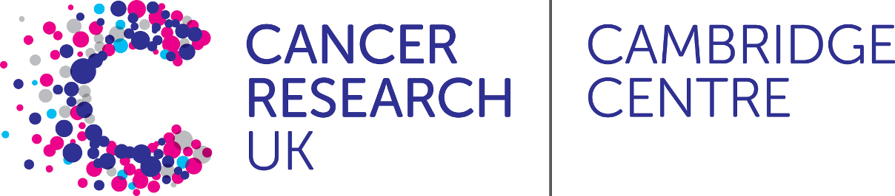

# CRUK Bioinformatics Summer School 2020: Functional Genomics
.  
**22nd - 28th July 2020: Zoom virtual school, University of Cambridge**

Site short-cut: https://tinyurl.com/crukss2020

## Overview

Functional genomics looks at the dynamic aspects of how the genome functions within cells,
particularly in the form of gene expression (transcription) and gene regulation. This workshop surveys
current methods for functional genomics using high-throughput technologies. 

High-throughput technologies such as next generation sequencing (NGS) can routinely produce massive amounts of data. However, such datasets pose new challenges in the way the data have to be analyzed, annotated and interpreted which are not trivial and are daunting to the wet-lab biologist. This course covers state-of-the-art and best-practice tools for bulk RNA-seq and ChIP-seq data analysis, and will also introduce approaches in prognostic gene signatures.

**[Outline timetable here](timetable.md)**.   

### Audience

Enthusiastic and motivated wet-lab biologists who want to gain more of an understanding of NGS data and eventually progress to analysing their own data

### Pre-requisites

**The course will include a great deal of hands-on work in R and at the command line. In order for you to make the most of the course we <u>strongly recommend</u> that you take an introductory course, or have sufficient experience in the following areas:**

- R
- Unix
- Introductory statistics

**More specific requirements and references can be found [here](Pre-requisites.md)**   

 # (**Data files for course are [here](https://www.dropbox.com/sh/l1qhs5tqwdxe81w/AAA2KGKXuMAPUwW1a9DGMS5la?dl=0). There is a zip-file for each course and a sizes.txt file with zip sizes **   )

### Instructors & helpers

- [Mark Fernandes (CRUK CI)](https://www.cruk.cam.ac.uk/author/mark-fernandes). 
- [Rory Stark (CRUK CI)](https://www.cruk.cam.ac.uk/author/rory-stark).  
- [Shoko Hirosue (MRC CU)](https://www.samarajiwa-lab.org/shokohirosue). 
- [Joanna Krupka (MRC CU)](https://www.samarajiwa-lab.org/joannakrupka).  
- [Ashley Sawle (CRUK CI)](https://www.cruk.cam.ac.uk/author/ashley-sawle).  
- [Abigail Edwards (CRUK CI](https://www.cruk.cam.ac.uk/author/abigail-edwards).  
- [Stephane Ballereau (CRUK CI)](https://www.cruk.cam.ac.uk/author/stephane-ballereau).     
- [Dominique-Laurent Couturier(CRUK CI)](https://www.cruk.cam.ac.uk/author/dominique-laurent-couturier).   
- [Zeynep Kalender Atak(CRUK CI)](http://www.miller-lab.org/cv_zka.html).  
- [Chandra Sekhar Reddy Chilamakuri (CRUK CI)](https://www.cruk.cam.ac.uk/author/chandra-chilamakuri).  
- [Gordon Brown(CRUK CI)](https://www.cruk.cam.ac.uk/author/gordon-brown).  
- [Matthew Eldridge (CRUK CI)](https://www.cruk.cam.ac.uk/author/matthew-eldridge).  
- [Katarzyna Kania (CRUK CI)](https://www.cruk.cam.ac.uk/author/katarzyna-kania).  

### Support Team

**Craik-Marshall team**.  
- Alexia Cordona.  
- Cathy Hemmings. 
- Paul Judge.  
**CRUK Cambridge Centre**.  
- Louisa Bellis.     
- Justin Holt.    

### Aims
During this course you will learn about:-

- How aligned sequencing reads, genome sequences and genomic regions are represented in R.
- How to handle NGS data and read sequencing data with R, perform quality assessment and execute standard pipelines for (bulk) RNA-Seq and ChIP-Seq analysis
- How to do downstream analysis of transcription factor (TF) and epigenomic (histone mark) ChIP-seq data.  

### Objectives
After the course you should be able to:-

- Know what tools are available in Bioconductor for HTS analysis and understand the basic object-types that are utilised.
- Process and quality control short read sequencing data 
- Given a set of gene identifiers, find out whereabouts in the genome they are located, and vice-versa 
- Produce a list of differentially expressed genes from an RNA-Seq experiment.
- Import a set of ChIP-Seq peaks and investigate their biological context.

# Day 0 (July 21st )

**SOCIAL
18:00 - ..
Informal get-together on Zoom with optional pub-quiz. Meet fellow attendees and some of your trainers.    

School Shared document is [here](https://docs.google.com/document/d/1UDB3l7p7dScvxXEP3x8geiUWYj4ZeOp8x5tXq5Qe8YQ/edit) **

# Day 1 (July 22nd)

__Zoom Virtual Training room__.  
 **July 22nd - 28th 2020**
- 09:00 - 09:40; Welcome (Paul & Mark)  &  [What is Functional Genomics?](Introduction/What%20is%20Functional%20Genomics.pdf) (Rory)
- 09:40 - 12:30; Data Processing for Next Generation Sequencing (Joanna & Shoko)
  + Lecture 1: [Introduction to next generation sequencing](Introduction/Preprocessing/slides/L1-summerSchool.pdf) 
  + Lecture 2: [Quality control and trimming](Introduction/Preprocessing/slides/L2-summerSchool.pdf) 
  + Practical 1: [QC and quality trimming of raw sequencing reads](Introduction/Preprocessing/practicals/P1_Preprocessing.html) 
  + Lecture 3: [Short read alignment and Quality Control](Introduction/Preprocessing/slides/L3-summerSchool.pdf) 
  + Practical 2: [Short read alignment with STAR](Introduction/Preprocessing/practicals/P2_Alignment.html) 

- 12:30 - 13:30; LUNCH BREAK

- 13:30 - 17:00; Bulk RNAseq  
  + [Introduction to RNA-seq](RNAseq/html/A_Introduction_to_RNAseq_Methods.html) - Ash Sawle  
  + [Quantification with SubRead](RNAseq/html/E_Read_Counts_with_Subread.html) - Abbi Edwards  
    - [Practical](RNAseq/html/E_Read_Counts_with_Subread.practical.html)    
    - [Practical solutions](RNAseq/html/E_Read_Counts_with_Subread.Solutions.html)   
  + [RNA-seq Pre-processing](RNAseq/html/02_Preprocessing_Data.html) - Chandra Chilamakuri   
    - [Practical solutions](RNAseq/html/02_Preprocessing_Data.Solutions.html)

  + [Extended Material](RNAseq/Extended_index.md)

 
# Day 2 (July 23rd)

- 09:30 - 17:00; Bulk RNAseq
  + [Introduction to RNAseq Analysis in R](RNAseq/html/01_Introduction_to_Differential_Gene_Expression_Analysis_in_R.html) - Ash Sawle 
  + [Statistical Analysis of Bulk RNAseq Data](Stats/StatsRNAseq_Couturier.pdf) - Dominique-Laurent Couturier     
      - [Practical (html)](Stats/StatsRNAseq_Couturier.html) [(rmd)](Stats/StatsRNAseq_Couturier.Rmd)  
  + [Experimental Design of Bulk RNAseq studies](RNAseq/html/ExperimentalDesignCourse_Nagarajan_20-05-2020.pdf) - Chandra Chilamakuri   
      - [Practical](RNAseq/html/RNAseq_ExperimentalDesignPractical.pdf)    

- 13:00 - 14:00; LUNCH BREAK

  + [Differential Expression for RNA-seq](RNAseq/html/04_DE_analysis_with_DESeq2.html) - Abbi Edwards  
    - [practical solutions](RNAseq/html/04_DE_analysis.Solutions.html)
    - [Abbi's live script](RNAseq/liveScripts/deseq2.R)

# Day 3 (July 24th)

- 09:30 - 12:30;  Bulk RNAseq
  + [Annotation and Visualisation of RNA-seq results](RNAseq/html/05_Annotation_and_Visualisation.html) - Ash Sawle  
    - [practical solutions](RNAseq/html/05_Annotation_and_Visualisation.Solutions.html)
    - [Ash's live script](RNAseq/liveScripts/05_Annotation_and_Visualisation.R)
  + [Gene-set testing](RNAseq/html/06_Gene_set_testing.html) - Ash Sawle   
    - [slides](RNAseq/html/06_Introduction_to_Functional_Analysis_in_R.html)  
    - [Ashs' live script](RNAseq/liveScripts/06_Geneset_testing.R)
    - [practical solutions](RNAseq/html/06_Gene_set_testing.Solutions.html)

- 12:30 - 13:30; LUNCH
- 13:30 - 17:00; Single Cell RNAseq (Stephane, & Kasia)
    + [scRNA-seq - introduction, inc design - PDF version](scRNAseq/
Introduction_to_Single_Cell_RNAseq.pdf)
    + [scRNA-seq - preamble](scRNAseq/html/index2.nb.html)
    + [scRNA-seq - sequencing QC](scRNAseq/html/seqQual.nb.html)
    + [scRNA-seq - alignment and cellranger](scRNAseq/html/cellRanger.html)
    + [scRNA-seq - preprocessing, inc cell calling](scRNAseq/html/preProc.html)
    
**6pm SOCIAL: Zoom Talk: “Perspectives in AI for Cancer Bioinformatics by Rory Stark”. **
 

# Weekend - recharge your batteries!

[SOCIAL: Virtual punting tour of Cambridge](https://www.tripadvisor.co.uk/LocationPhotoDirectLink-g186225-d2281676-i235494912-Cambridge_River_Tour-Cambridge_Cambridgeshire_England.html)

[SOCIAL: Virtual tour of Cambridge University Botanical Gardens](https://youtu.be/MyCGUi0WKN4)

[SOCIAL/WORK: Virtual tour of CRUK Cambridge Institute](https://poly.google.com/view/bjq4wL5U1Fo)

[SOCIAL: Aeriel 360 panoramas of Cambridge venues](https://www.xcopters.co.uk/virtualtours.html)

[WORK: For those who feel the need to brush up on their linux skills](https://datacarpentry.org/shell-genomics/)

[WORK: For those wanting an R course with extensive use of Tidyverse](https://bioinformatics-core-shared-training.github.io/bite-size-r-intermediate/)

# Day 4 (July 27th)

- 09:30 - 17:00; Single Cell RNAseq (cont.) (Stephane & Zeynep)
    + [scRNA-seq - normalisation](scRNAseq/html/normalisation_GSM3872434_simple.html)
    + [scRNA-seq - dimension reduction for visualisation](scRNAseq/html/dimRedForViz.nb.html)
    + [scRNA-seq - detecting confounding factors](scRNAseq/html/confounding_caron.nb.html)
    + [scRNA-seq - feature selection](scRNAseq/html/featSelec.nb.html)
    + [scRNA-seq - batch correction](scRNAseq/html/batch_GSM3872442.nb.html)
    + [scRNA-seq - dimensionality reduction for analysis](scRNAseq/html/dimRedForAna.nb.html)
    + [scRNA-seq - clustering](scRNAseq/html/clustering.nb.html)
    + [scRNA-seq - marker gene identification](scRNAseq/html/clusterMarkerGenes.nb.html)
    + [scRNA-seq - cell cycle assignment](scRNAseq/html/cellCyclePhases.nb.html)
    + [scRNA-seq - data set integration - PBMMC](scRNAseq/html/dataSetIntegration_PBMMC.html) [- whole](dataSetIntegrationWhole_1kCps.nb.html) 
    + [scRNA-seq - diff exp between condition](scRNAseq/html/multiSplComp.nb.copy.html)
    + [scRNA-seq - trajectory analysis - 1](scRNAseq/html/trajectory1.nb.html) [2](scRNAseq/html/trajectory2.nb.html) [3](scRNAseq/html/trajectory3.nb.html) 

- 12:30 - 13:30; LUNCH BREAK

# Day 5 (July 28th)

- 09:30 - 17:00; 
- ChIP-seq data analysis
    + Lecture 1a: [Introduction to ChIP-seq](ChIPSeq/Materials/Lectures/Day4/L1.1_Introduction_to_ChIP-seq_SS.pdf) 
    + Lecture 1b: [Introduction to Peak Calling](ChIPSeq/Materials/Lectures/Day4/L1.2_Peak_Calling_SS.pdf) 
    + Practical 1: [Peak calling with MACS2](ChIPSeq/Materials/Practicals/Day4/Practical1_PeakCalling_SS.html)
    + Lecture 2: [Differential binding analysis](ChIPSeq/Materials/Lectures/Day4/L2_Differential_Binding_Analysis_DB.pdf) 
    + Practical 2: [THOR (and Diffbind)](ChIPSeq/Materials/Practicals/Day4/Practical2_diffbind_practical_DB.html) 
    + Lecture 3: [Quality control methods for ChIP-seq](ChIPSeq/Materials/Lectures/Day4/L3_Quality_Control_Methods_for_ChIPseq_DB.pdf)

    + Practical 3: [Integrative Genome Viewer](ChIPSeq/Materials/Practicals/Day4/Practical3_IGV_practical_DB.html) 
    + Lecture 4: [Downstream analysis of ChIP-seq](ChIPSeq/Materials/Lectures/Day4/L4_Downstream_Analysis_of_ChIPseq_SS.pdf) 
    + Practical 4: [Downstream analysis of ChIP-seq](ChIPSeq/Materials/Practicals/Day4/Practical4_Downstream_Analysis_of_ChIP-seq_SS.html) 
 
- 12:30 - 13:30; LUNCH BREAK
## Please don't forget to fill in the [survey]()   

<!--
## Data
- Mouse mammary data (counts): [https://figshare.com/s/1d788fd384d33e913a2a](https://figshare.com/s/1d788fd384d33e913a2a)
-->
